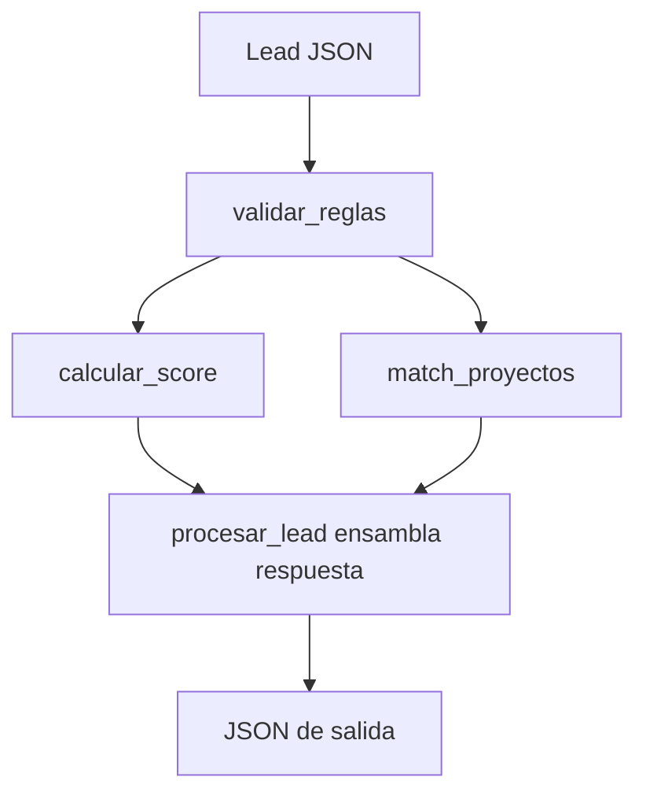

# Motor de Perfilamiento — Documentación de API y Reglas de Negocio

Asesor Digital de Vivienda (Colsubsidio). Este documento describe los endpoints REST, los contratos de datos (input/output) y la lógica de decisión de cada módulo.

> **Estado de este documento:** refleja el código de las Fases 0-7 (`schemas.py`,
> `reglas.py`, `scoring.py`, `motor.py`, `config.py` ya actualizados). El
> catálogo de proyectos (`catalogo.py`) **todavía usa CSV** en el código que
> corre hoy — la migración a `proyectos.json` con `buyerPersona` y tipologías
> está diseñada (ver `plan.md` sección 5) pero **no implementada en código
> todavía**. Las secciones marcadas 🚧 documentan ese diseño en curso, no el
> comportamiento actual del servidor. Para el detalle de cómo y por qué decide
> cada regla, ver `REGLAS_DE_NEGOCIO.md`.

---

## Índice

1. [Arquitectura](#arquitectura)
2. [API REST](#api-rest)
3. [Contratos de datos](#contratos-de-datos)
4. [Flujo de procesamiento](#flujo-de-procesamiento)
5. [Módulos y reglas de decisión](#módulos-y-reglas-de-decisión)
6. [Parámetros configurables](#parámetros-configurables)
7. [Catálogo de proyectos](#catálogo-de-proyectos)
8. [🚧 Próxima iteración: catálogo JSON + tipologías](#próxima-iteración-catálogo-json--tipologías)

---

## Arquitectura

```
Cliente (POST lead JSON)
        │
        ▼
┌───────────────────┐
│   app/api/        │  Capa HTTP — valida esquema, expone endpoints
└─────────┬─────────┘
          │
          ▼
┌───────────────────┐
│   app/motor.py    │  Orquestador — ensambla la respuesta final
└─────────┬─────────┘
          │
    ┌─────┼─────┐
    ▼     ▼     ▼
 reglas  scoring  catalogo
    │       │
    └───────┴── config.py (parámetros de negocio)
```

| Módulo | Archivo | Responsabilidad |
|--------|---------|-----------------|
| API | `app/api/routes.py`, `app/api/routes_afiliados.py`, `app/api/schemas.py` | Recibir JSON, devolver JSON |
| Motor | `app/motor.py` | Orquestar el flujo completo |
| Reglas | `app/reglas.py` | Elegibilidad y viabilidad financiera |
| Scoring | `app/scoring.py` | Prioridad comercial y matching de proyectos |
| Catálogo | `app/catalogo.py` | Carga de proyectos (hoy CSV, 🚧 migrando a JSON) |
| Afiliados | `app/repositories/afiliados_csv.py` | Consulta de afiliados por cédula (simula bodega real) |
| Config | `app/config.py` | Constantes editables del negocio |

---

## API REST

**Base URL:** `http://localhost:8000`
**Arranque:**

```bash
uvicorn main:app --reload --host 0.0.0.0 --port 8000
```

**Documentación interactiva:** `http://localhost:8000/docs`

Para exponer el servidor local a internet (pruebas remotas, demo): `ngrok http 8000`.

### `GET /health`

Verifica que el servicio esté activo.

**Respuesta `200`:**

```json
{ "status": "ok" }
```

---

### `GET /afiliados/{id_usuario}`

Consulta si una persona está afiliada a Colsubsidio y con qué datos ya cuenta
la caja — capa delgada sobre `AfiliadosRepository`, no hace scoring ni
elegibilidad. Pensado para que el front lo consulte **antes** de armar la
conversación del asesor virtual (RF-03/RF-04).

**Respuesta `200`** (siempre 200 — "no afiliado" es una respuesta de negocio
válida, no un error):

```json
{ "afiliado": true, "datos": { "nombre": "...", "categoria": "...", "antiguedad_meses": 24, "personas_a_cargo": 2 } }
```

o si no existe / no está afiliado:

```json
{ "afiliado": false, "datos": null }
```

**Decisión de responsabilidad (cerrada):** el front consulta este endpoint,
arma la conversación con el usuario, y es quien ensambla el JSON completo del
lead (incluyendo los campos de afiliación) para mandarlo a `POST /perfilar`.
El backend confía en lo que el front envía — `motor.py` no vuelve a consultar
este repositorio dentro de `/perfilar`. Ver `plan.md` sección 6 para la
alternativa evaluada y descartada.

---

### `POST /perfilar`

Procesa un lead y devuelve validación, score, proyectos recomendados y resumen.

**Headers:**

```
Content-Type: application/json
```

**Body:** objeto `LeadInput` (ver [Contrato de entrada](#contrato-de-entrada-leadinput)).

**Respuesta `200`:** objeto `PerfilamientoResponse` (ver [Contrato de salida](#contrato-de-salida-perfilamientoresponse)).

**Respuesta `422`:** error de validación del esquema (campo con tipo incorrecto, p. ej. ingresos negativos).

**Respuesta `500`:** error interno durante el procesamiento.

**Ejemplo de request (estructura anidada vigente):**

```json
{
  "id_usuario": "1018300400",
  "nombre": "Diana Martínez",
  "afiliado": true,
  "categoria": "B",
  "antiguedad_meses": 24,
  "tipo_cotizante": "dependiente",
  "ingresos_mensuales": 2900000,
  "grupo_sisben": "C2",
  "edad": 31,
  "personas_a_cargo": 2,
  "condiciones_especiales": {
    "cabeza_de_hogar": true,
    "discapacidad_hogar": false,
    "mayor_65_anos": false
  },
  "propietario_vivienda": false,
  "subsidio_previo": false,
  "subsidio_previo_fue_arrendamiento": false,
  "finanzas": {
    "cesantias": 3000000,
    "ahorros": 5000000,
    "credito_preaprobado": true
  },
  "tipo_empresa": "Medianas",
  "zona_preferida": "Bogotá",
  "valor_vivienda_deseada": 150000000,
  "origen": "organico"
}
```

**Ejemplo con curl:**

```bash
curl -X POST http://localhost:8000/perfilar \
  -H "Content-Type: application/json" \
  -d @lead.json
```

---

## Contratos de datos

### Contrato de entrada: `LeadInput`

Esquema Pydantic en `app/api/schemas.py`. Acepta campos adicionales (`extra="allow"`) que se conservan en `lead_original` de la respuesta.

**⚠️ Rompe compatibilidad con el schema plano anterior:** `cabeza_de_hogar`,
`tiene_discapacidad_hogar`, `cesantias`, `ahorros` ya no se reconocen en el
nivel raíz — deben ir anidados en `condiciones_especiales` / `finanzas`.

| Campo | Tipo | Default | Descripción |
|-------|------|---------|-------------|
| `id_usuario` | `string \| null` | `null` | Cédula/identificador, para cruzar con `/afiliados` |
| `nombre` | `string \| null` | `null` | Nombre del postulante |
| `afiliado` | `boolean` | `false` | Si es afiliado a Colsubsidio |
| `categoria` | `string \| null` | `null` | Categoría de afiliación (informativo) |
| `antiguedad_meses` | `integer \| null` | `null` | Meses de afiliación (requerido si `afiliado=true`) |
| `tipo_cotizante` | `string \| null` | `null` | `"dependiente"` \| `"independiente"` \| `"pensionado"` |
| `ingresos_mensuales` | `number` | `0` | Ingresos del hogar en COP (≥ 0) |
| `grupo_sisben` | `string \| null` | `null` | Ej. `"C2"`; fuera de A1-D21 o vacío → no califica a Subsidio Concurrente |
| `edad` | `integer \| null` | `null` | Edad del postulante |
| `personas_a_cargo` | `integer \| null` | `null` | Personas a cargo — decide Segmentación de Caja |
| `condiciones_especiales.cabeza_de_hogar` | `boolean` | `false` | — |
| `condiciones_especiales.discapacidad_hogar` | `boolean` | `false` | — |
| `condiciones_especiales.mayor_65_anos` | `boolean` | `false` | Dato explícito, ya no se calcula de `edad` |
| `propietario_vivienda` | `boolean` | `false` | Si ya es propietario de vivienda |
| `subsidio_previo` | `boolean` | `false` | Si el hogar ya recibió subsidio de vivienda antes |
| `subsidio_previo_fue_arrendamiento` | `boolean` | `false` | Excepción legal: si el subsidio previo fue de arrendamiento, no bloquea |
| `finanzas.cesantias` | `number` | `0` | Cesantías acumuladas en COP (≥ 0) |
| `finanzas.ahorros` | `number` | `0` | Ahorros en COP (≥ 0) |
| `finanzas.credito_preaprobado` | `boolean` | `false` | Usado en el override de prioridad RN-04 |
| `tipo_empresa` | `string \| null` | `null` | `Micro`, `Medianas`, `Top` (u otro valor del catálogo) |
| `zona_preferida` | `string \| null` | `null` | Municipio o zona de interés |
| `valor_vivienda_deseada` | `number \| null` | `null` | COP; valida tope VIS/VIP |
| `origen` | `string \| null` | `null` | `"organico"` u otro (p. ej. `"meta"`) |

---

### Contrato de salida: `PerfilamientoResponse`

Respuesta ensamblada por `procesar_lead()` en `app/motor.py`.

```json
{
  "lead_info": {
    "nombre": "string | null",
    "afiliado": "boolean",
    "prioridad": "string",
    "segmentacion_caja": "Basico | Medio | Alto | Joven"
  },
  "financial_score": {
    "viable": "SI | NO",
    "motivos_rechazo": ["string"],
    "subsidio_estimado": "integer",
    "descalifica_subsidio_por_techo_ingresos": "boolean",
    "capacidad_max_cuota": "integer",
    "cierre_financiero": {
      "precio_referencia_vivienda": "integer",
      "cuota_inicial_requerida": "integer",
      "ahorro_disponible": "number",
      "cierre_viable": "boolean"
    },
    "subsidio_concurrente_mi_casa_ya": {
      "disponible": "boolean",
      "monto_adicional_estimado": "integer"
    },
    "subsidio_arrendamiento": {
      "sugerido": "boolean",
      "monto_mensual_estimado": "integer",
      "meses": "integer",
      "monto_total_estimado": "integer"
    },
    "condiciones_subsidio": {
      "dentro_de_tope_ingresos": "boolean",
      "sin_rechazo_por_reglas_duras": "boolean",
      "zona_con_cobertura_subsidio": "boolean",
      "vivienda_dentro_de_tope_vis_vip": "boolean"
    }
  },
  "score_detalle": {
    "score_total": "integer",
    "prioridad": "ALTA | MEDIA | BAJA",
    "override_rn04_aplicado": "boolean",
    "factores": {
      "afiliado": "integer",
      "cierre_financiero_viable": "integer",
      "matching_historico": "integer",
      "cesantias": "integer",
      "ahorros": "integer",
      "condicion_especial": "integer",
      "grupo_sisben": "integer",
      "credito_preaprobado": "integer",
      "origen_organico": "integer"
    }
  },
  "matching_projects": [
    {
      "proyecto": "string",
      "municipio": "string",
      "tipo": "VIS | VIP",
      "precio": "integer",
      "match_score": "number",
      "motivo": "string",
      "cierre_financiero": {
        "cuota_inicial_requerida": "integer",
        "ahorro_disponible": "number",
        "cierre_viable": "boolean",
        "subsidio_aplicable": "integer"
      }
    }
  ],
  "ai_summary": "string",
  "lead_original": { "...": "lead de entrada completo" }
}
```

#### Campos clave de la salida (actualizado)

| Sección | Campo | Significado |
|---------|-------|-------------|
| `lead_info.prioridad` | Etiqueta comercial | Prioridad del score + sufijo `(90/10)` si es afiliado con prioridad ALTA |
| `lead_info.segmentacion_caja` | **Nuevo** | Básico/Medio/Alto/Joven, calculado (ver `REGLAS_DE_NEGOCIO.md` sección 4) |
| `financial_score.viable` | `"SI"` / `"NO"` | Deriva de `puede_comprar` en reglas duras |
| `financial_score.descalifica_subsidio_por_techo_ingresos` | **Nuevo** | Distinto de `viable` — el lead puede comprar pero sin ayuda de la caja |
| `financial_score.subsidio_concurrente_mi_casa_ya` | **Corregido** | Antes salía siempre `null` por un bug de nombre de clave; ya funciona |
| `score_detalle.override_rn04_aplicado` | **Nuevo** | `true` si la prioridad ALTA vino del override RN-04, no del score numérico |
| `matching_projects[].cierre_financiero` | **Nuevo** | Cierre financiero calculado por proyecto candidato, no contra el promedio del portafolio |

---

### Contrato interno: `ValidacionReglas`

Retornado por `validar_reglas()`. No se expone directamente en la API, pero alimenta `financial_score` y el scoring.

| Campo | Tipo | Descripción |
|-------|------|-------------|
| `puede_comprar` | `boolean` | `true` solo si no hay motivos de rechazo |
| `motivos_rechazo` | `string[]` | Reglas duras incumplidas |
| `ingresos_en_smmlv` | `number` | Ingresos expresados en SMMLV |
| `aplica_subsidio` | `boolean` | Si cumple las 4 condiciones de la sección 3.2 de `REGLAS_DE_NEGOCIO.md` |
| `subsidio_estimado` | `integer` | Monto en COP según matriz |
| `condiciones_subsidio` | `object` | Detalle auditable de cada condición del subsidio (RNF-02) |
| `descalifica_subsidio_por_techo_ingresos` | `boolean` | **Nuevo** |
| `cuota_maxima_mensual` | `integer` | 40% de ingresos mensuales |
| `cierre_financiero` | `object` | Comparación ahorro vs cuota inicial |
| `subsidio_concurrente_mi_casa_ya` | `object` | — |
| `subsidio_arrendamiento_sugerido` | `object` | — |
| `segmentacion_caja` | `string` | **Nuevo** |

---

### Contrato interno: `ProyectoCatalogo` (vigente hoy — CSV)

Cada fila de `data/proyectos.csv`, cargada al iniciar la app.

| Campo | Tipo | Descripción |
|-------|------|-------------|
| `proyecto` | `string` | Nombre del proyecto |
| `municipio` | `string` | Ubicación |
| `tipo` | `string` | `VIS` o `VIP` |
| `precio` | `integer` | Precio en COP |
| `ingreso_promedio_comprador` | `integer` | Perfil histórico de compradores |
| `edad_promedio_comprador` | `integer` | Edad promedio histórica |
| `tipo_empresa_predominante` | `string` | `Micro`, `Medianas` o `Top` |
| `descripcion` | `string` | Texto descriptivo |

🚧 Ver sección 8 para el reemplazo diseñado (`proyectos.json` + tipologías).

---

## Flujo de procesamiento



**Orden de ejecución:**

1. `validar_reglas(lead)` — reglas duras de elegibilidad + subsidio + segmentación de caja.
2. `calcular_score(lead, validacion)` — prioridad comercial 0–100 + override RN-04.
3. `match_proyectos(lead, validacion)` — top 3 proyectos asequibles y dentro de tope VIS/VIP.
4. `procesar_lead()` — construye contrato de salida y `ai_summary`.

---

## Módulos y reglas de decisión

> Documentación funcional detallada (con el "por qué" de cada regla) en
> `REGLAS_DE_NEGOCIO.md`. Aquí solo el resumen técnico de dónde vive cada cosa.

### 1. `app/config.py` — Parámetros de negocio

Centraliza constantes editables. No contiene lógica; define los umbrales que usan los demás módulos.

### 2. `app/catalogo.py` — Catálogo de proyectos (CSV, vigente hoy)

**Qué hace:** carga `data/proyectos.csv` al arrancar y expone `CATALOGO_PROYECTOS`.

**Decisiones:**
- Si el CSV no existe → catálogo vacío (el matching devuelve lista vacía).
- Convierte `precio`, `ingreso_promedio_comprador` y `edad_promedio_comprador` a enteros.

### 3. `app/reglas.py` — Validación de elegibilidad

**Función:** `validar_reglas(lead) → ValidacionReglas`

Lee la estructura anidada del lead (`finanzas.cesantias`, `finanzas.ahorros`)
a través de helpers (`_finanzas`, `_cesantias`, `_ahorros`). Reglas duras,
elegibilidad de subsidio, matriz de monto y segmentación de caja — ver
`REGLAS_DE_NEGOCIO.md` secciones 1, 2 y 4 para el detalle completo de cada
una.

### 4. `app/scoring.py` — Prioridad comercial

**Función:** `calcular_score(lead, validacion) → ScoreDetalle`

Pesos actuales en `CONFIG["SCORING_WEIGHTS"]`: `afiliado` (25 / -10 si no
afiliado), `cierre_financiero_viable` (10), `matching_historico` (hasta 20),
`cesantias` (8), `ahorros` (4), `condicion_especial` (10), `grupo_sisben` (8),
`credito_preaprobado` (10), `origen_organico` (5). Override de prioridad
RN-04 documentado en `REGLAS_DE_NEGOCIO.md` sección 6.

**`matching_historico` sigue con la fórmula anterior** (distancia a un
promedio del catálogo CSV) — el rediseño a afinidad por `buyerPersona`
(sección 8) está en diseño, no implementado.

### 5. `app/scoring.py` — Matching de proyectos

**Función:** `match_proyectos(lead, validacion, top_n=3) → ProyectoMatch[]`

Dos filtros independientes: (1) VIS/No VIS por tope de municipio —
**exclusión total**, no informativo; (2) asequibilidad financiera. Ninguno
depende de la afinidad histórica — ver `REGLAS_DE_NEGOCIO.md` sección 7 para
el razonamiento de por qué estos ejes se mantienen separados. El cierre
financiero (30% cuota inicial) se calcula por proyecto candidato, no contra
el precio promedio del portafolio.

### 6. `app/motor.py` — Orquestador

**Función:** `procesar_lead(lead) → PerfilamientoResponse`

Ensambla la respuesta completa, incluyendo los campos nuevos de
`reglas.py`/`scoring.py`. Corregido el bug de `subsidio_concurrente` (nombre
de clave incorrecto que hacía que ese campo saliera siempre `null`).

---

## Parámetros configurables

Archivo: `app/config.py`

| Parámetro | Valor actual | Uso |
|-----------|--------------|-----|
| `SMMLV_2026` | $1.750.905 | Conversión ingresos → SMMLV y subsidio |
| `TOPE_INGRESOS_SMMLV` | 4 | Tope para calificar a subsidio |
| `LIMITE_CUOTA_INGRESO` | 0.40 | Regla del 40% |
| `MATRIZ_SUBSIDIOS` | 30 SMMLV (0–2), 20 SMMLV (2–4) | Monto de subsidio |
| `PORCENTAJE_CUOTA_INICIAL_REQUERIDO` | 0.30 | Cierre financiero |
| `ANTIGUEDAD_MINIMA_MESES_POR_TIPO` | 6 (los tres tipos) | Afiliados |
| `VIS_TOPE_SMMLV_PRINCIPAL` | 150 | Tope VIS en municipio principal |
| `VIS_TOPE_SMMLV_OTROS` | 135 | Tope VIS en otros municipios |
| `VIP_TOPE_SMMLV` | 90 | ⚠️ definido pero aún no conectado al chequeo de tope |
| `MUNICIPIOS_PRINCIPALES` | bogota, soacha, chia, cota, girardot | Tope VIS 150 vs. 135 |
| `ZONAS_COBERTURA_SUBSIDIO` | Bogotá + Cundinamarca (lista ampliada, incluye tocancipa/ricaurte/ubate) | Cobertura del subsidio |
| `UBICACIONES_DISPONIBLES` | 8 valores reales | Catálogo cerrado de `ubicacion` de `proyectos.json` |
| `UBICACION_A_MUNICIPIO` | mapeo ubicación → municipio | Necesario porque no todas las ubicaciones son municipios (ej. "Ciudadela Maiporé") |
| `SISBEN_ORDEN_GRUPOS` | A1…D21 en orden | Comparación por índice, no por texto |
| `SISBEN_SUBSIDIO_MATRIZ` | urbana/rural, tabla oficial | Subsidio Concurrente SISBEN |
| `SISBEN_ZONA_DEFAULT` | `"urbana"` | ⚠️ fallback hasta que exista el campo real en el lead |
| `SEGMENTACION_CAJA_BASICO_MAX_SMMLV` | 1.44 | Segmentación de Caja |
| `SEGMENTACION_CAJA_MEDIO_MAX_SMMLV` | 20 | Segmentación de Caja |
| `SEGMENTACION_CAJA_JOVEN_EDAD_MAX` | 39 | Segmentación de Caja |

### Pesos de scoring (`SCORING_WEIGHTS`)

| Factor | Peso |
|--------|------|
| afiliado | 25 |
| no_afiliado_penalizacion | -10 |
| cierre_financiero_viable | 10 |
| matching_historico | 20 |
| cesantias | 8 |
| ahorros | 4 |
| condicion_especial | 10 |
| grupo_sisben | 8 |
| credito_preaprobado | 10 |
| origen_organico | 5 |
| **Total teórico (afiliado + todos)** | **85** |

### Umbrales de prioridad (`SCORE_THRESHOLDS`)

| Prioridad | Umbral mínimo |
|-----------|---------------|
| ALTA | 70 (o override RN-04, ver sección 4 de `REGLAS_DE_NEGOCIO.md`) |
| MEDIA | 40 |
| BAJA | < 40 |

---

## Catálogo de proyectos

Archivo: `data/proyectos.csv` (vigente hoy — ver sección 8 para el reemplazo diseñado)

| Proyecto | Municipio | Tipo | Precio (COP) |
|----------|-----------|------|--------------|
| Ciudadela Maiporé | Soacha | VIS | 165.000.000 |
| Abeto - Araucaria | Bogotá (Calle 80) | VIS | 210.000.000 |
| Reserva de Guayacán | Girardot | VIS | 140.000.000 |
| Monguí | Bogotá | VIS | 180.000.000 |
| Versalles | Bogotá | VIS | 195.000.000 |
| La Macarena Reservada | Bogotá | VIP | 120.000.000 |

---

## 🚧 Próxima iteración: catálogo JSON + tipologías

**No implementado en código todavía.** Documentado aquí para que quien retome
el trabajo sepa hacia dónde va, sin confundirlo con el contrato que corre hoy.
Diseño completo en `plan.md` sección 5 y `propuesta.md`.

- `proyectos.json` reemplaza `data/proyectos.csv` como única fuente del catálogo.
- Cada proyecto trae `tipologias` (lista de `{nombre, precio}`) en vez de un
  precio único — el filtro de asequibilidad y el cierre financiero deben
  evaluarse por tipología, no por proyecto.
- `buyerPersona` (distribución porcentual real de compradores históricos por
  categoría) reemplaza `ingreso_promedio_comprador`/`edad_promedio_comprador`
  y alimenta el rediseño de `matching_historico` (afinidad por bucket, no
  distancia a un promedio).
- El bucket de `salario` se parsea dinámicamente del texto (`"Hasta X smlv"`,
  `"Mas de X smlv"`, `"Entre X y Y smlv"`) porque no todos los proyectos usan
  el mismo catálogo de categorías.
- Se excluyen del matching: proyectos con muestra histórica muy chica (Abeto,
  Vibonce) y la fila "Total" (agregado, no es un proyecto real).
- El filtro VIS/No VIS pasa a ser exclusión total (no solo informativo).

---

## Notas de integración

- La API no persiste leads; cada request es stateless.
- Campos extra en el JSON de entrada se conservan en `lead_original`.
- Si el catálogo está vacío, `matching_projects` será `[]` y `matching_historico` será 0.
- La regla 90/10 (priorización de afiliados) se refleja en la etiqueta `(90/10)`, en el peso del factor `afiliado`, **y ahora también en la penalización activa cuando `afiliado == false`** — no solo como ausencia de bono.