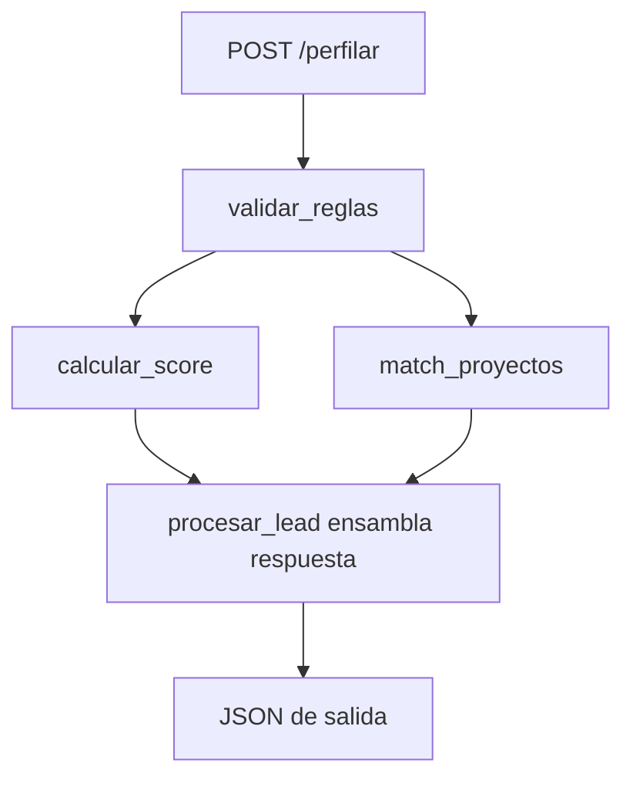

# Motor de Perfilamiento — Documentación de API y Reglas de Negocio

Asesor Digital de Vivienda (Colsubsidio). Este documento describe los endpoints REST, los contratos de datos (input/output) y la lógica de decisión de cada módulo.

---

## Índice

1. [Arquitectura](#arquitectura)
2. [API REST](#api-rest)
3. [Contratos de datos](#contratos-de-datos)
4. [Flujo de procesamiento](#flujo-de-procesamiento)
5. [Módulos y reglas de decisión](#módulos-y-reglas-de-decisión)
6. [Parámetros configurables](#parámetros-configurables)
7. [Catálogo de proyectos](#catálogo-de-proyectos)

---

## Arquitectura

```
Cliente (POST lead JSON)
        │
        ▼
┌───────────────────┐
│   app/api/        │  Capa HTTP — valida esquema, expone endpoints
└─────────┬─────────┘
          │
          ▼
┌───────────────────┐
│   app/motor.py    │  Orquestador — ensambla la respuesta final
└─────────┬─────────┘
          │
    ┌─────┼─────┐
    ▼     ▼     ▼
 reglas  scoring  catalogo
    │       │
    └───────┴── config.py (parámetros de negocio)
```

| Módulo | Archivo | Responsabilidad |
|--------|---------|-----------------|
| API | `app/api/routes.py`, `app/api/schemas.py` | Recibir JSON, devolver JSON |
| Motor | `app/motor.py` | Orquestar el flujo completo |
| Reglas | `app/reglas.py` | Elegibilidad y viabilidad financiera |
| Scoring | `app/scoring.py` | Prioridad comercial y matching de proyectos |
| Catálogo | `app/catalogo.py` | Carga de proyectos desde CSV |
| Config | `app/config.py` | Constantes editables del negocio |

---

## API REST

**Base URL:** `http://localhost:8000`  
**Arranque:**

```bash
uvicorn main:app --reload --host 0.0.0.0 --port 8000
```

**Documentación interactiva:** `http://localhost:8000/docs`

### `GET /health`

Verifica que el servicio esté activo.

**Respuesta `200`:**

```json
{ "status": "ok" }
```

---

### `POST /perfilar`

Procesa un lead y devuelve validación, score, proyectos recomendados y resumen.

**Headers:**

```
Content-Type: application/json
```

**Body:** objeto `LeadInput` (ver [Contrato de entrada](#contrato-de-entrada-leadinput)).

**Respuesta `200`:** objeto `PerfilamientoResponse` (ver [Contrato de salida](#contrato-de-salida-perfilamientoresponse)).

**Respuesta `422`:** error de validación del esquema (campo con tipo incorrecto, p. ej. ingresos negativos).

**Respuesta `500`:** error interno durante el procesamiento.

**Ejemplo de request:**

```json
{
  "nombre": "Diana Martínez",
  "afiliado": true,
  "categoria": "B",
  "antiguedad_meses": 24,
  "ingresos_mensuales": 2900000,
  "edad": 31,
  "personas_a_cargo": 2,
  "cabeza_de_hogar": true,
  "tiene_discapacidad_hogar": false,
  "propietario_vivienda": false,
  "tipo_empresa": "Medianas",
  "cesantias": 3000000,
  "ahorros": 5000000,
  "zona_preferida": "Bogotá",
  "origen": "organico"
}
```

**Ejemplo con curl:**

```bash
curl -X POST http://localhost:8000/perfilar \
  -H "Content-Type: application/json" \
  -d @lead.json
```

---

## Contratos de datos

### Contrato de entrada: `LeadInput`

Esquema Pydantic en `app/api/schemas.py`. Acepta campos adicionales (`extra="allow"`) que se conservan en `lead_original` de la respuesta.

| Campo | Tipo | Default | Descripción |
|-------|------|---------|-------------|
| `nombre` | `string \| null` | `null` | Nombre del postulante |
| `afiliado` | `boolean` | `false` | Si es afiliado a Colsubsidio |
| `categoria` | `string \| null` | `null` | Categoría de afiliación (informativo) |
| `antiguedad_meses` | `integer \| null` | `null` | Meses de afiliación (requerido si `afiliado=true`) |
| `ingresos_mensuales` | `number` | `0` | Ingresos del hogar en COP (≥ 0) |
| `edad` | `integer \| null` | `null` | Edad del postulante |
| `personas_a_cargo` | `integer \| null` | `null` | Personas a cargo (informativo) |
| `cabeza_de_hogar` | `boolean` | `false` | Cabeza de hogar |
| `tiene_discapacidad_hogar` | `boolean` | `false` | Discapacidad en el hogar |
| `propietario_vivienda` | `boolean` | `false` | Si ya es propietario de vivienda |
| `tipo_empresa` | `string \| null` | `null` | `Micro`, `Medianas` o `Top` |
| `cesantias` | `number` | `0` | Cesantías acumuladas en COP (≥ 0) |
| `ahorros` | `number` | `0` | Ahorros en COP (≥ 0) |
| `zona_preferida` | `string \| null` | `null` | Municipio o zona de interés |
| `origen` | `string \| null` | `null` | `"organico"` u otro (p. ej. `"meta"`) |

---

### Contrato de salida: `PerfilamientoResponse`

Respuesta ensamblada por `procesar_lead()` en `app/motor.py`.

```json
{
  "lead_info": {
    "nombre": "string | null",
    "afiliado": "boolean",
    "prioridad": "string"
  },
  "financial_score": {
    "viable": "SI | NO",
    "motivos_rechazo": ["string"],
    "subsidio_estimado": "integer",
    "capacidad_max_cuota": "integer",
    "cierre_financiero": {
      "precio_referencia_vivienda": "integer",
      "cuota_inicial_requerida": "integer",
      "ahorro_disponible": "number",
      "cierre_viable": "boolean"
    }
  },
  "score_detalle": {
    "score_total": "integer",
    "prioridad": "ALTA | MEDIA | BAJA",
    "factores": {
      "afiliado": "integer",
      "cierre_financiero_viable": "integer",
      "matching_historico": "integer",
      "ahorro_previo": "integer",
      "condicion_especial": "integer",
      "origen_organico": "integer"
    }
  },
  "matching_projects": [
    {
      "proyecto": "string",
      "municipio": "string",
      "tipo": "VIS | VIP",
      "precio": "integer",
      "match_score": "number",
      "motivo": "string"
    }
  ],
  "ai_summary": "string",
  "lead_original": { "...": "lead de entrada completo" }
}
```

#### Campos clave de la salida

| Sección | Campo | Significado |
|---------|-------|-------------|
| `lead_info.prioridad` | Etiqueta comercial | Prioridad del score + sufijo `(90/10)` si es afiliado con prioridad ALTA |
| `financial_score.viable` | `"SI"` / `"NO"` | Deriva de `puede_comprar` en reglas duras |
| `financial_score.motivos_rechazo` | Lista | Vacía si viable; contiene razones legales/de negocio si no |
| `score_detalle.score_total` | 0–100 | Suma ponderada de factores comerciales |
| `matching_projects` | Top 3 | Proyectos asequibles ordenados por `match_score` |

---

### Contrato interno: `ValidacionReglas`

Retornado por `validar_reglas()`. No se expone directamente en la API, pero alimenta `financial_score` y el scoring.

| Campo | Tipo | Descripción |
|-------|------|-------------|
| `puede_comprar` | `boolean` | `true` solo si no hay motivos de rechazo |
| `motivos_rechazo` | `string[]` | Reglas duras incumplidas |
| `ingresos_en_smmlv` | `number` | Ingresos expresados en SMMLV |
| `aplica_subsidio` | `boolean` | Si ingresos ≤ tope de subsidio |
| `subsidio_estimado` | `integer` | Monto en COP según matriz |
| `cuota_maxima_mensual` | `integer` | 40% de ingresos mensuales |
| `cierre_financiero` | `object` | Comparación ahorro vs cuota inicial |

---

### Contrato interno: `ProyectoCatalogo`

Cada fila de `data/proyectos.csv`, cargada al iniciar la app.

| Campo | Tipo | Descripción |
|-------|------|-------------|
| `proyecto` | `string` | Nombre del proyecto |
| `municipio` | `string` | Ubicación |
| `tipo` | `string` | `VIS` o `VIP` |
| `precio` | `integer` | Precio en COP |
| `ingreso_promedio_comprador` | `integer` | Perfil histórico de compradores |
| `edad_promedio_comprador` | `integer` | Edad promedio histórica |
| `tipo_empresa_predominante` | `string` | `Micro`, `Medianas` o `Top` |
| `descripcion` | `string` | Texto descriptivo |

---

## Flujo de procesamiento



**Orden de ejecución:**

1. `validar_reglas(lead)` — reglas duras de elegibilidad.
2. `calcular_score(lead, validacion)` — prioridad comercial 0–100.
3. `match_proyectos(lead, validacion)` — top 3 proyectos asequibles.
4. `procesar_lead()` — construye contrato de salida y `ai_summary`.

---

## Módulos y reglas de decisión

### 1. `app/config.py` — Parámetros de negocio

Centraliza constantes editables. No contiene lógica; define los umbrales que usan los demás módulos.

---

### 2. `app/catalogo.py` — Catálogo de proyectos

**Qué hace:** carga `data/proyectos.csv` al arrancar y expone `CATALOGO_PROYECTOS`.

**Decisiones:**

- Si el CSV no existe → catálogo vacío (el matching devuelve lista vacía).
- Convierte `precio`, `ingreso_promedio_comprador` y `edad_promedio_comprador` a enteros.

---

### 3. `app/reglas.py` — Validación de elegibilidad

**Función:** `validar_reglas(lead) → ValidacionReglas`

**Objetivo:** determinar si el lead **puede comprar** según reglas duras (ley y negocio). El cierre financiero se calcula aquí pero **no bloquea** la compra; solo informa viabilidad de cuota inicial.

#### Reglas de rechazo (`puede_comprar = false`)

| # | Condición | Motivo generado |
|---|-----------|-----------------|
| 1 | `propietario_vivienda == true` | "El postulante o su hogar ya son propietarios de vivienda" |
| 2 | `afiliado == true` y `antiguedad_meses < 6` | "Antigüedad de afiliación insuficiente (X meses, mínimo 6)" |
| 3 | `ingresos_mensuales * 0.40 <= 0` | "Ingresos insuficientes para calcular cuota de crédito" |

> `puede_comprar` es `true` **solo** cuando `motivos_rechazo` está vacío.

#### Cálculo de subsidio

```
ingresos_en_smmlv = ingresos_mensuales / SMMLV_2026
```

| Rango de ingresos (SMMLV) | Subsidio |
|---------------------------|----------|
| 0 ≤ ingresos < 2 SMMLV | 30 SMMLV → $52.527.150 |
| 2 ≤ ingresos < 4 SMMLV | 20 SMMLV → $35.018.100 |
| ≥ 4 SMMLV | No aplica (`subsidio_estimado = 0`) |

Se recorre `MATRIZ_SUBSIDIOS` y se aplica el **primer rango** que coincida.

#### Regla del 40% (cuota máxima)

```
cuota_maxima_mensual = round(ingresos_mensuales × 0.40)
```

#### Cierre financiero (informativo, no bloqueante)

```
precio_referencia = promedio de precios VIS del catálogo
cuota_inicial_requerida = precio_referencia × 0.30
ahorro_disponible = cesantías + ahorros + subsidio_estimado
cierre_viable = ahorro_disponible >= cuota_inicial_requerida
```

---

### 4. `app/scoring.py` — Prioridad comercial

**Función:** `calcular_score(lead, validacion) → ScoreDetalle`

**Objetivo:** asignar un score 0–100 y una prioridad comercial (`ALTA`, `MEDIA`, `BAJA`).

#### Factores y pesos

| Factor | Peso máx. | Condición para sumar puntos |
|--------|-----------|----------------------------|
| `afiliado` | 30 | `afiliado == true` |
| `cierre_financiero_viable` | 25 | `cierre_financiero.cierre_viable == true` |
| `matching_historico` | 20 | `20 × similitud_máxima_catalogo` (0–20) |
| `ahorro_previo` | 10 | `cesantías + ahorros > 0` |
| `condicion_especial` | 10 | cabeza de hogar **o** discapacidad **o** edad ≥ 65 |
| `origen_organico` | 5 | `origen == "organico"` |

```
score_total = suma de factores
```

#### Umbrales de prioridad

| Prioridad | Condición |
|-----------|-----------|
| `BAJA` | `puede_comprar == false` (sin importar el score) |
| `ALTA` | `score_total >= 70` |
| `MEDIA` | `40 <= score_total < 70` |
| `BAJA` | `score_total < 40` |

#### Similitud histórica (`matching_historico`)

Para cada proyecto del catálogo se calcula una similitud 0–1:

```
score_ingresos = max(0, 1 - |ingresos_lead - ingreso_promedio| / ingreso_promedio)
score_edad     = max(0, 1 - |edad_lead - edad_promedio| / 20)
score_empresa  = 1.0 si tipo_empresa coincide, else 0.3

similitud = 0.5×score_ingresos + 0.3×score_edad + 0.2×score_empresa
```

Se toma la **similitud máxima** del catálogo para el factor `matching_historico`.

---

### 5. `app/scoring.py` — Matching de proyectos

**Función:** `match_proyectos(lead, validacion, top_n=3) → ProyectoMatch[]`

**Objetivo:** recomendar hasta 3 proyectos asequibles y ordenados por afinidad.

#### Paso 1 — Filtro de asequibilidad

Un proyecto entra al pool solo si:

```
monto_credito_estimado = cuota_maxima_mensual × 120   # ~10 años
monto_total_disponible = ahorro_disponible + subsidio + monto_credito_estimado

proyecto.precio <= monto_total_disponible
```

#### Paso 2 — Score de match

```
match_score = min(1.0, similitud + bono_zona)
```

| Componente | Regla |
|------------|-------|
| `similitud` | Misma fórmula de similitud histórica (ingresos, edad, empresa) |
| `bono_zona` | +0.1 si `zona_preferida` aparece como substring en `municipio` (case-insensitive) |

#### Paso 3 — Ordenamiento y recorte

- Orden descendente por `match_score`.
- Se devuelven los **top 3**.
- Cada proyecto incluye un `motivo` en texto plano explicando el match.

---

### 6. `app/motor.py` — Orquestador

**Función:** `procesar_lead(lead) → PerfilamientoResponse`

**Decisiones propias:**

| Campo | Lógica |
|-------|--------|
| `lead_info.prioridad` | Prioridad del score; añade `" (90/10)"` si `afiliado=true` y prioridad es `ALTA` |
| `financial_score.viable` | `"SI"` si `puede_comprar`, `"NO"` en caso contrario |
| `ai_summary` | Texto generado según viabilidad, zona, mejor proyecto y subsidio |

**Resumen (`ai_summary`):**

- Si **no viable:** lista motivos de rechazo + "Requiere ruta de mejora de perfil."
- Si **viable:** `"Lead {prioridad} interesado en {zona}. Mejor match: {proyecto}. Subsidio estimado: ${monto}."`

---

## Parámetros configurables

Archivo: `app/config.py`

| Parámetro | Valor actual | Uso |
|-----------|--------------|-----|
| `SMMLV_2026` | $1.750.905 | Conversión ingresos → SMMLV y subsidio |
| `TOPE_INGRESOS_SMMLV` | 4 | Tope para calificar a subsidio |
| `LIMITE_CUOTA_INGRESO` | 0.40 | Regla del 40% |
| `MATRIZ_SUBSIDIOS` | 30 SMMLV (0–2), 20 SMMLV (2–4) | Monto de subsidio |
| `PORCENTAJE_CUOTA_INICIAL_REQUERIDO` | 0.30 | Cierre financiero |
| `ANTIGUEDAD_MINIMA_MESES` | 6 | Afiliados |
| `VIS_TOPE_SMMLV_PRINCIPAL` | 150 | Reservado para reglas futuras |
| `VIS_TOPE_SMMLV_OTROS` | 135 | Reservado para reglas futuras |
| `VIP_TOPE_SMMLV` | 90 | Reservado para reglas futuras |
| `MUNICIPIOS_PRINCIPALES` | bogota, soacha, chia, cota, girardot | Reservado para reglas futuras |

### Pesos de scoring (`SCORING_WEIGHTS`)

| Factor | Peso |
|--------|------|
| afiliado | 30 |
| cierre_financiero_viable | 25 |
| matching_historico | 20 |
| ahorro_previo | 10 |
| condicion_especial | 10 |
| origen_organico | 5 |
| **Total teórico** | **100** |

### Umbrales de prioridad (`SCORE_THRESHOLDS`)

| Prioridad | Umbral mínimo |
|-----------|---------------|
| ALTA | 70 |
| MEDIA | 40 |
| BAJA | < 40 |

---

## Catálogo de proyectos

Archivo: `data/proyectos.csv`

| Proyecto | Municipio | Tipo | Precio (COP) |
|----------|-----------|------|--------------|
| Ciudadela Maiporé | Soacha | VIS | 165.000.000 |
| Abeto - Araucaria | Bogotá (Calle 80) | VIS | 210.000.000 |
| Reserva de Guayacán | Girardot | VIS | 140.000.000 |
| Monguí | Bogotá | VIS | 180.000.000 |
| Versalles | Bogotá | VIS | 195.000.000 |
| La Macarena Reservada | Bogotá | VIP | 120.000.000 |

**Precio de referencia VIS** (promedio usado en cierre financiero):

```
(165M + 210M + 140M + 180M + 195M) / 5 = $178.000.000
cuota_inicial_requerida = $178.000.000 × 0.30 = $53.400.000
```

---

## Notas de integración

- La API no persiste leads; cada request es stateless.
- Campos extra en el JSON de entrada se conservan en `lead_original`.
- Si el catálogo está vacío, `matching_projects` será `[]` y `matching_historico` será 0.
- La regla 90/10 (priorización de afiliados) se refleja en la etiqueta `(90/10)` y en el peso de 30 puntos del factor `afiliado`, no como regla de rechazo.
